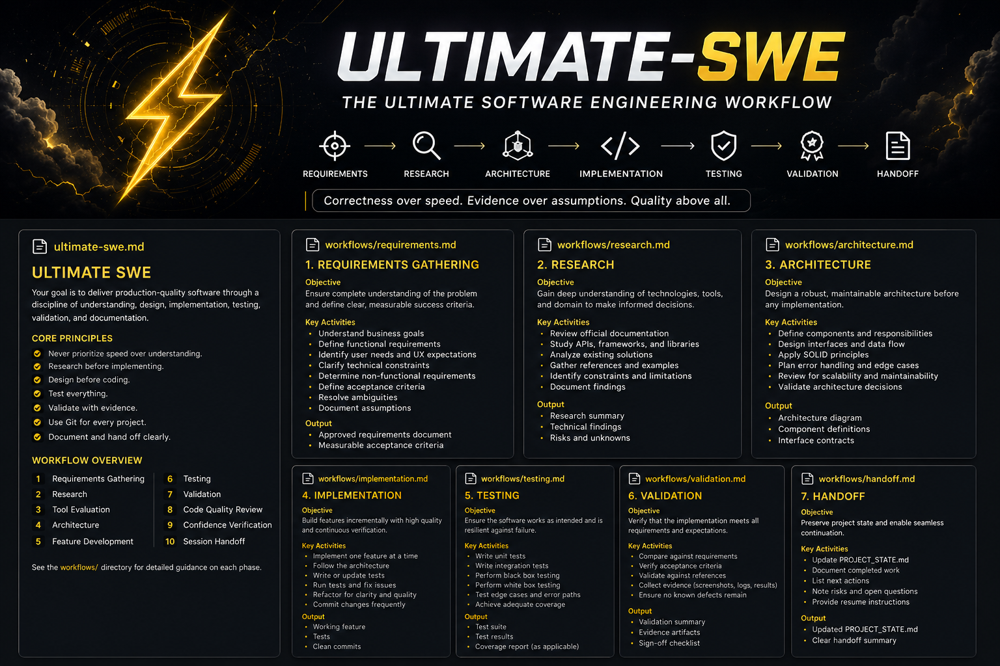

<div align="center">

# ⚡ Ultimate SWE ⚡

### Production-Grade Software Engineering Workflow

*Requirements → Research → Architecture → Implementation → Testing → Validation → Handoff*

[]()
[]()
[]()
[]()

[]()

</div>

---

## ⚡ What is Ultimate SWE?

Ultimate SWE is a disciplined software engineering framework designed to produce production-quality software through rigorous requirements gathering, research, architecture-first development, testing, validation, and structured project handoff.

The workflow prioritizes:

* Correctness over speed
* Evidence over assumptions
* Testing over hope
* Architecture before implementation
* Maintainability over cleverness
* Git-first development

---

## 🧠 Core Principles

```text
Understand First
      ↓
Research
      ↓
Design
      ↓
Implement
      ↓
Test
      ↓
Validate
      ↓
Document
      ↓
Ship
```

---

## 🚀 Workflow

| Phase            | Purpose                      |
| ---------------- | ---------------------------- |
| Requirements     | Eliminate ambiguity          |
| Research         | Understand technologies      |
| Tool Evaluation  | Choose the correct solution  |
| Architecture     | Design before coding         |
| Implementation   | Build one feature at a time  |
| Testing          | Verify correctness           |
| Validation       | Compare against requirements |
| Code Review      | Improve maintainability      |
| Confidence Check | Verify completion            |
| Handoff          | Preserve project state       |

---

## 📂 Repository Layout

```text
ultimate-swe/
├── ultimate-swe.md
├── workflows/
└── templates/
```

### Skill Definition

* `ultimate-swe.md`

### Detailed Workflows

* `workflows/requirements.md`
* `workflows/research.md`
* `workflows/architecture.md`
* `workflows/implementation.md`
* `workflows/testing.md`
* `workflows/validation.md`
* `workflows/handoff.md`

### Templates

* `templates/PROJECT_STATE.md`

---

## ⚡ Git Requirements

Every project must:

1. Initialize Git immediately
2. Make an initial commit
3. Use meaningful commit messages
4. Commit frequently
5. Keep changes reviewable
6. Maintain a clean history

Development without version control is prohibited unless explicitly requested.

---

## 🎯 Completion Criteria

A feature is complete only when:

* Requirements are satisfied
* Documentation has been reviewed
* Tests have been written
* Validation has been performed
* Evidence exists
* Known issues are documented

---

## ⭐ Growth Path

```text
Junior Developer
      ★

Understands Requirements
      ★★

Writes Tests
      ★★★

Designs Systems
      ★★★★

Validates Everything
      ★★★★★

Ultimate SWE
      ★★★★★★
```

Built for engineers who prefer evidence over assumptions.

## Star History

[](https://star-history.com/#YOUR_USERNAME/ultimate-swe&Date)