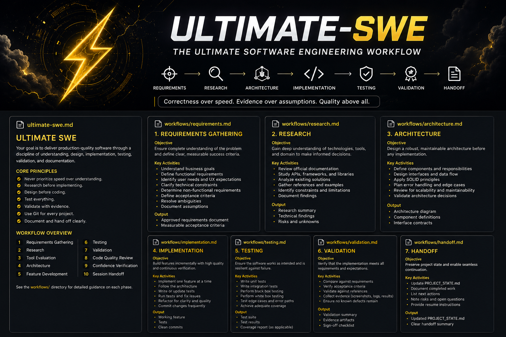

<div align="center">

# ⚡ Ultimate SWE ⚡

### Production-Grade Software Engineering Workflow

*Requirements → Research → Architecture → Implementation → Testing → Validation → Deployment → Handoff*

[]()
[]()
[]()
[]()

[]()

</div>

---

## 📦 Installation

**Via skills CLI (recommended)**

```bash
npx skills add https://github.com/SamuelH98/Ultimate-SWE --skill ultimate-swe
```

---

## ⚡ What is Ultimate SWE?

Ultimate SWE is a disciplined software engineering framework designed to produce production-quality software through rigorous requirements gathering, research, architecture-first development, testing, validation, and structured project handoff.

The workflow prioritizes:

* Correctness over speed
* Evidence over assumptions
* Testing over hope
* Architecture before implementation
* Maintainability over cleverness
* Git-first development
* Search current sources over trusting memory
* Two failed attempts = change approach, not retry harder

---

## 🧠 Core Principles

```text
Understand First
      ↓
Research (live web, not memory) ⇄ Troubleshoot if stuck
      ↓
Design
      ↓
Implement
      ↓
Test
      ↓
Validate
      ↓
Deploy
      ↓
Document
      ↓
Ship
```

Research and Troubleshooting form a loop, not a single pass — any unfamiliar error or a fix that fails twice sends the workflow back into that loop instead of guessing forward.

---

## 🚀 Workflow

| Phase            | Purpose                                     |
| ---------------- | -------------------------------------------- |
| Scope Check      | Match rigor to task risk                     |
| Requirements     | Eliminate ambiguity                          |
| Research         | Understand technologies via live web search  |
| Architecture     | Design before coding                         |
| Implementation   | Build one feature at a time                  |
| Troubleshooting  | Break stuck loops after 2 failed attempts    |
| Testing          | Verify correctness                           |
| Code Review      | Improve maintainability                      |
| Validation       | Compare against requirements                 |
| Deployment       | Ship safely with a rollback plan             |
| Handoff          | Preserve project state                       |

---

## 📂 Repository Layout

```text
skills/ultimate-swe/
├── SKILL.md
├── workflows/
└── templates/
```

### Skill Definition

* `SKILL.md`

### Detailed Workflows

* `workflows/requirements.md`
* `workflows/research.md`
* `workflows/architecture.md`
* `workflows/implementation.md`
* `workflows/troubleshooting.md`
* `workflows/testing.md`
* `workflows/validation.md`
* `workflows/deployment.md`
* `workflows/handoff.md`

### Templates

* `templates/PROJECT_STATE.md`

---

## ⚡ Git Requirements

Every project must:

1. Initialize Git immediately
2. Make an initial commit
3. Use meaningful commit messages
4. Commit frequently
5. Keep changes reviewable
6. Maintain a clean history

Development without version control is prohibited unless explicitly requested.

---

## 🎯 Completion Criteria

A feature is complete only when:

* Requirements are satisfied
* Documentation has been reviewed
* Tests have been written
* Validation has been performed
* Evidence exists
* Known issues are documented

---

## ⭐ Growth Path

```text
Junior Developer
      ★

Understands Requirements
      ★★

Writes Tests
      ★★★

Designs Systems
      ★★★★

Validates Everything
      ★★★★★

Ultimate SWE
      ★★★★★★
```

Built for engineers who prefer evidence over assumptions.

## Star History

[](https://star-history.com/#SamuelH98/Ultimate-SWE&Date)